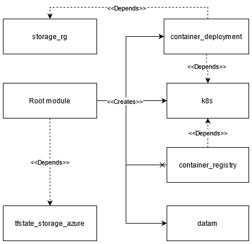

# SMADDIS/Smad-deploy-azure
## Project description
Project description comes here
SMAD specific Kuksa yms.

## Setup

### Prerequisities

- [Azure subscription](https://azure.microsoft.com/en-us/free/)

### Tools needed 

- [Azure CLI](https://docs.microsoft.com/en-us/cli/azure/install-azure-cli) (local environment) or [Azure Cloud Shell](https://docs.microsoft.com/en-us/azure/cloud-shell/overview)
- [Terraform](https://www.terraform.io/downloads.html) (version >= 0.14)
- [Kubectl](https://kubernetes.io/docs/tasks/tools/)

### Other helpful tools (not needed for setup)

- [Kubectx](https://github.com/ahmetb/kubectx)
- [Helm](https://helm.sh/docs/intro/install/)

### Infrastucture preparation for Kuksa Cloud

In order to deploy SMAD specific Kuksa Cloud, Terraform is first used create necessary infrastucture resources into Microsoft Azure.

#### Authenticate to Azure

Be sure to authenticate to Azure using Azure CLI before running these Terraform scripts.

If you are running these scripts in Azure Cloud Shell you are already authenticated.

Otherwise, you can login using, for example, Azure CLI interactively:
`$ az login`

For other login options see Azure documentation provided by Microsoft:
https://docs.microsoft.com/en-us/cli/azure/authenticate-azure-cli

#### Select a subscription

After you authenticate with Azure CLI, check that the selected 
subscription is the one you want to use:
`$ az account show --output table`

You can list all subscriptions you can use:
`$ az account list --output table`

To change your selected subscription
`$ az account set -s <$SUBSCRIPTION_ID_OR_NAME>`

#### Terraform Workspaces

It is recommended that you familiarize yourself with [Terraform Workspaces](https://www.terraform.io/docs/language/state/workspaces.html) concept and utilize them when using these scripts.

Create a new workspace named e.g. 'development' with `terraform workspace new development` before creating any resources other than shared state you
- Enable creation of multiple AKS clusters within the same state file
- Prevent accidental deletion of other clusters within the same state file

#### Setting variables before deploying resources

TODO: real world example!!!

##### via a tfvars file
Run `$ terraform apply -var-file=./example.tfvars` to set variables from 'example.tfvars' -file.
##### via command line arguments
Run `$ terraform apply -var='foo=bar'` to set a variable named 'foo' to have value 'bar' via command line.

#### Terraform plan

Run `$ terraform plan` to see the resources that will be deployed.

#### 0. Create a storage account to store shared state for Terraform
[Shared state](https://www.terraform.io/docs/language/state/remote.html) should always be preferred when working with Terraform.

In order to create one you run `$ terraform apply './modules/tfstate_storage_azure/'` module.

This creates:
- Azure Resource Group (default name 'kuksatrng-tfstate-rg')
- Azure Storage Account (default name 'kuksatrngtfstatesa')
- Azure Storage Container (default name 'tfstate')

You can customize naming in './modules/tfstate_storage_azure/variables.tf'.
Check file content for naming restrictions and details.

#### 1. Deploy the SMAD stack

In order to deploy a K8S cluster and the resources within it with default parameters (see variables.tf) run `$ terraform apply` in the root folder.

##### Workspace-specific configurations

TODO:  real world example!!!

###### Default workspace:
Resources are not prefixed, so only one instance of the deployment can be set up at a time. The cluster is assigned 3 nodes in the default workspace configuration.
###### Non-default workspace:
Resources are prefixed, so multiple instances of the deployment can be set up at a time. The cluster is assigned 2 nodes in the non-default workspace configuration.

## Configuration

### Modifying resources created by Terraform

Resources created by Terraform should be modified via Terraform. If you modify resources created by Terraform using e.g. Kubectl, you may end up in a situation where terraform state is out of sync. 

If you change the configuration by e.g. changing the code and run `terraform apply`, Terraform will try to modify the resources in place whenever possible. If in-place modification is not possible, Terraform will first  destroy and then apply the modified resources. Run `terraform plan` to see the changes.

#### Using the target flag 

The `-target` flag can be used to apply and destroy only specific resources: 
`terraform apply -target=module.container_deployment.helm_release.mongodb`

Note that resources that depend on the targeted resource will also be destroyed if you run `terraform destroy -target`. 

Similarly, when running `terraform apply -target`, if resources that are needed by the targeted resource do not exist, Terraform cannot apply the targeted resources.

## Testing that Hono works

`tests/honoscript` folder has a shell script that can be used to quickly verify that Hono is running properly. Refer to `tests/honoscript/README.md` for more details.

---

# Smad-deploy-azure architecture description
 
This is a architectural description of the smad-deploy-azure
 
|Folder|Description|Depends on|
|------|----------|-------|
|./|Root folder||
|./modules|Modules used by the script. |
|../container_deployment|Handles deployment of the stack via Helm to k8s cluster. Holds all the information regarding setting up the cloud environment| k8s
|../container_registry| Creates ACR for k8s cluster. **Currently not used**| k8s
|../k8s|Module for  creating kubernetes cluster to Azure (AKS)
|../tfstate_storage_azure|Creates resource group for terraform state file|
|../datam|Gets value from remote state file located in Azure subscription.
|../storage_rg|Creates separate resource group for persistent data needs|

Every module follows the conventional Terraform naming scheme, and therefore has `main.tf`, `variables.tf` and `outputs.tf` files.

## Description

## Root folder

### `main.tf`

Used for deploying modules and setting up proper environment for kubernetes and helm providers, and azurerm backend.

Project name is prefixed with Terraform Workspace name.

#### `module "k8s_cluster_azure"`
 
Uses module specified in `./modules/k8s/`  folder for deploying Kubernetes cluster under `k8test-rg resource group`. Node count of cluster is controlled  by `k8s_agent_count` variable, where node count for default terraform workspace is 3, and non-default workspace is 2.

#### `module "container_deployment"`

Uses module specified in `./modules/container_deployment/`  folder for deploying services on previously created Kubernetes cluster. Custom MongoDB username and password could be supplied to services, otherwise default is used.

Kubernetes and Helm providers are configured with outputs acquired from created k8s cluster module.

### `variables.tf`

#### ``variable "project_name"``

Used to specify project name. No need to change because Terraform Workspace prefix can create unique project names.

#### ``variable "k8s_agent_count"``

Node count for clusters using "default" Terraform Workspace

#### ``variable "testing_k8s_agent_count"``

Node count for clusters using non-default Terraform Workspace. Used for test deployments.

#### ``variable "mongodb_username"``

MongoDB username for deployed MongoDB instance. Can be specified with .tfvars

#### ``variable "mongodb_password"``

MongoDB password for deployed MongoDB instance. Can be specified with .tfvars

### `outputs.tf`

Outputs for kube config files and path's for it

#### `example.tfvars`

Example .tfvars for supplying custom variables.

## Container deployment module - container_deployment

**Depends on `k8s module`**

This module handles all the aspects of deploying smad service stack. Which consists of Hono, MongoDB, Prometheus, Jaeger and Grafana. Uses Helm for deployment.

### `main.tf`

#### `resource "helm_release" "mongodb"`

Values used by service are supplied by `mongo_values.yaml` -file. Sensitive values such as usernames and passwords acquired from variables.tf

#### `resource "helm_release" "hono"`

Deploys Hono from Helm Chart. Uses `hono_values.yaml` for configuration and sensitive values from MongoDB are acquired from variables.tf. Deploys only after kube-prometheus-stack has succesfully deployed.

#### `resource "helm_release" "ingress-nginx"`

Used for creating ingress for Jaeger-query service

#### `resource "helm_release" "jaeger-operator"`

Deploys jaeger-operator, and is configured with values from `jaeger_values.yaml`

#### ``resource "kubernetes_config_map" "grafana_hono_dashboards"``

Creates kubernetes config map and supplies preconfigured Grafana dashboards via .json

#### `resource "helm_release" "kube-prometheus-stack"`

Deploys kube-prometheus-stack which consists of Prometheus, kube metrics and grafana. 
### `variables.tf`

Holds information related to mondogb username and passwords. Can be configured independetly otherwise defaults used.

### `hono_values.yaml`

Configures Hono helm chart to use separately deployed jaeger-operator.
Also configures to use separately deployed MongoDB for Hono device registry.
Other services provided by Hono Helm chart are disabled. Smad-deploy-azure uses separately deployed and configured services.

### `jaeger_values.yaml`

TBC

### `prom_values.yaml`

Configures grafana, prometheus as LoadBalancers, and configures scrape configs for Hono.

### `mongodb_values.yaml`

Configures persistence volumeclaim for MongoDB, and enables materis and statefuls set.

## Kubernetes deployment module - k8s

This module can be deploy independetly because of provider specifications in module.

### `main.tf`

Creates resource group for Kubernetes cluster with project name and resource_group_name suffix specified in variables.

Log analytics workspace is also created with ContainerInsights name.

Kubernetes cluster is created with `resource "azurerm_kubernetes_cluster" "k8s_cluster"` under previously created resource group.

#### `resource "kubernetes_storage_class" "azure-disk-retain"`

Creates storage class with reclaim policy of retain.

#### ``resource "kubernetes_persistent_volume_claim" "example"``

Creates persistent volume claim for MongoDB.

### `variables.tf` 

Contains variables for naming all the resources and specifying node count. Project name, k8s_agent_count and resource_group_name_suffix variables can be set from root main.tf

### `outputs.tf` 

Output values acquired from k8s_clusters kube config. 
THese include client keys, cerficates, usernames, passwords and hosts for k8s cluster.

## Terraform state module - tfstate_storage_azure

### `main.tf`
This module is to be ran separately, because it creates needed Terraform State files and storage account and container to Azure

### `variables.tf`

Hold variables for naming resources created by this module.

### `outputs.tf`

Output values four resource group, storage account and storate container.

## Contrainer registry module - container_registry **NOT USED**

**Depends on k8s module**

### `main.tf`

Creates Azure Container registry in the same resource group as k8s modules.

Assigns acrpull role for k8s cluster
### `variables.tf`

Variables for naming resources.

### `outputs.tf`

Output values for ACR. Containing id, login url, username and password.

## Datamanager module - datam

This module used for getting data from remote Terraform state for creating role assingment in root folders `main.tf`

### `main.tf`

Data resource which uses previously created tfstate naming for getting informatio of created tfstate in Azure subscription

### `variables.tf`

### `outputs.tf`

Outputs remote state's id.
## Storage resource group - storage_rg

This modules creates separate resource group for persistent volume claim.

### `main.tf`

Establish azurerm backend with previously set naming for tfstate files, and create resource group named `storage-resource-group"`

### `variables.tf`

### `outputs.tf`

Output value of created resource group's id.