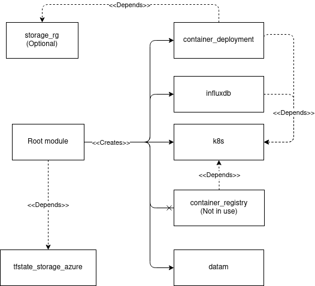

# Smad-deploy-azure architecture description
 
This is a architectural description of the smad-deploy-azure
 
|Folder|Description|Depends on|
|------|----------|-------|
|[./00_tfstate_storage](#Terraform-state-module)|Creates resource group for terraform state file|
|[./01_storage_rg](#Storage-resource-group)|Creates separate resource group for persistent data needs|
|[./02_container_registry](#Contrainer-registry-module)| Creates ACR for k8s cluster. **Currently not used**|
|[./02_deployHono](#Hono-service-stack-module)| Creates Hono k8s cluster and services
|.02_deployHono/modules|Modules used by the script. |
|[.../k8s](#Kubernetes-deployment-module)|Module for  creating kubernetes cluster to Azure (AKS)
|[.../ambassador](#Ambassador-deployment-module)|Handles deployment of Ambassador via Helm to k8s cluster | k8s
|[.../hono](#Hono-deployment-module)|Handles deployment of Hono via Helm to k8s cluster | k8s
|[../influxdb](#Influxdb-module)|Module that handles deployment of Influxdb to k8s cluster. Holds all the information to set up database for prometheus metrics | k8s
|[.../jaeger](#Jaeger-deployment-module)|Handles deployment of Jaeger via Helm to k8s cluster | k8s
|[.../kube_prometheus_stack](#kube-prometheus-stack-deployment-module)|Handles deployment of kube-prometheus-stack via Helm to k8s cluster. | k8s
|[.../mongodb](#Mongo-deployment-module)|Handles deployment of MongoDB via Helm to k8s cluster. | k8s


Every module follows the conventional Terraform naming scheme, and therefore has `main.tf`, `variables.tf` and `outputs.tf` files.

## Description



## Terraform state module

### `main.tf`
This module is to be ran separately, because it creates needed Terraform State files and storage account and container to Azure

### `variables.tf`

Hold variables for naming resources created by this module.

### `outputs.tf`

Output values four resource group, storage account and storate container.

## Storage resource group module

This modules creates separate resource group for persistent volume claim.

### `main.tf`

Establish azurerm backend with previously set naming for tfstate files, and create resource group named `storage-resource-group"`

### `variables.tf`

### `outputs.tf`

Output value of created resource group's id.

## Contrainer registry module

**NOT USED**

### `main.tf`

Creates Azure Container registry in the same resource group as k8s modules.

Assigns acrpull role for k8s cluster
### `variables.tf`

Variables for naming resources.

### `outputs.tf`

Output values for ACR. Containing id, login url, username and password.


## Hono service stack module


### `main.tf`

Used for deploying modules and setting up proper environment for kubernetes and helm providers, and azurerm backend.

Project name is prefixed with Terraform Workspace name.

#### `module "k8s"`
 
Uses module specified in `./modules/k8s/`  folder for deploying Kubernetes cluster under `k8test-rg resource group`. Node count of cluster is controlled  by `k8s_agent_count` variable, where node count for default terraform workspace is 3, and non-default workspace is 2. `use_separate_storage_rg` variable controls whether separate resource group for storage purposes is created

##### `resource "azurerm_role_assignment" "k8s-storage-role-ass"`

Role assingment for separate resource group. Gets scope value from datamodule. Created only when `use_separate_storage_rg` is true.

#### `module "hono"`

Uses module specified in `./modules/hono/`  folder for deploying Eclipse Hono on previously created Kubernetes cluster. Custom MongoDB username and password could be supplied to services, otherwise default is used.

Kubernetes and Helm providers are configured with outputs acquired from created k8s cluster module.

#### `module "influxdb"`

Adds bitnami helm charts that bootstrap a Influxdb deployment on the k8s cluster using the Helm package manager.

#### `module "mongodb"`

Adds bitnami helm charts that bootstrap a MongoDB deployment on the k8s cluster using the Helm package manager.

#### `module "kube_prometheus_stack"`
Adds helm charts that bootstrap a kube_prometheus_stack deployment on the k8s cluster using the Helm package manager. Includes Prometheus and Grafana.

#### `module "ambassador"`
Adds helm charts that bootstrap an Ambassador deployment on the k8s cluster using the Helm package manager.

#### `module "jaeger"`
Adds helm charts that bootstrap a Jaeger deployment on the k8s cluster using the Helm package manager.


### `variables.tf`

#### ``variable "project_name"``

Used to specify project name. No need to change because Terraform Workspace prefix can create unique project names.

#### ``variable "k8s_agent_count"``

Node count for clusters using "default" Terraform Workspace

#### ``variable "testing_k8s_agent_count"``

Node count for clusters using non-default Terraform Workspace. Used for test deployments.


#### ``variable "mongodb_username"``

MongoDB username for deployed MongoDB instance. Can be specified with .tfvars

#### ``variable "mongodb_password"``

MongoDB password for deployed MongoDB instance. Can be specified with .tfvars

### `outputs.tf`

Outputs for kube config files and path's for it

## Kubernetes deployment module

### `main.tf`

Creates resource group for Kubernetes cluster with project name and resource_group_name suffix specified in variables.

Log analytics workspace is also created with ContainerInsights name. By default Log Analytics are disabled. Log Analytics can be enabled by changing variable "enable_log_analytics" into true.

Kubernetes cluster is created with `resource "azurerm_kubernetes_cluster" "k8s_cluster"` under previously created resource group.

#### `resource "kubernetes_storage_class" "azure-disk-retain"`

Creates storage class with reclaim policy of retain. Resource group is defined with the `separate_storage_rg` variable, and if it is false then `null` value is used. This means that when resource group is `null` then resource group is created under the same resource group where k8s_cluster is.

#### ``resource "kubernetes_persistent_volume_claim" "mongodb"``

Creates persistent volume claim for MongoDB.

#### ``resource "kubernetes_persistent_volume_claim" "influxdb"``

Creates persistent volume claim for InfluxDB.

### `variables.tf` 

Contains variables for naming all the resources and specifying node count. Project name, k8s_agent_count and resource_group_name_suffix variables can be set from root main.tf

### `outputs.tf` 

Output values acquired from k8s_clusters kube config. 
THese include client keys, cerficates, usernames, passwords and hosts for k8s cluster.


## Hono deployment module

**Depends on `k8s module`**

This module handles deploying of Hono. Uses Helm for deployment.

Direct URL to chart's source is provided one line above a ``helm_release`` resource. Usually that URL is where one can see how the chart can be configured.
The chart values can be set either by giving the values in a .yaml file or by including a `set` block within the `helm_release` block.

In the current script, the chart values are mostly set by giving the values via the included .yaml file.

If the chart source page doesn't provide list of settable values, the values can also be shown by adding the repo and running `helm show values`:
```bash
$ helm repo add <choose_repo_name> <repo_url>
$ helm repo update
$ helm show values <chosen_repo_name>/<chart_name>
```

### `main.tf`

#### `resource "helm_release" "hono"`

Deploys Hono from Helm Chart. Uses `hono_values.yaml` for configuration and sensitive values from MongoDB are acquired from variables.tf. Deploys only after kube-prometheus-stack has succesfully deployed.

### `variables.tf`

Holds information related to mondogb username and passwords. Can be configured independetly otherwise defaults used.

### `values.yaml`

Configures to use separately deployed MongoDB for Hono device registry.
Other services provided by Hono Helm chart are disabled. Smad-deploy-azure uses separately deployed and configured services.

## Ambassador deployment module

**Depends on `k8s module`**

This module deploys Ambassador. Uses Helm for deployment.

### `main.tf`

### `variables.tf`

### `values.yaml`

## Mongo deployment module

**Depends on `k8s module`**

This module handles all the aspects of deploying MongoDB. Uses Helm for deployment.


### `main.tf`

#### `resource "helm_release" "mongodb"`

Values used by service are supplied by `values.yaml` -file. Sensitive values such as usernames and passwords acquired from variables.tf

### `variables.tf`

Holds information related to mondogb username and passwords. Can be configured independetly otherwise defaults used.

### `values.yaml`

Configures persistence volumeclaim for MongoDB, and enables metrics and statefuls set.

## Kube-prometheus-stack deployment module

**Depends on `k8s module`**

This module handles all the aspects of deploying Prometheus and Grafana. Uses Helm for deployment.

### `main.tf`

#### ``resource "kubernetes_secret" "grafana_hono_dashboards"``

Creates kubernetes config map and supplies preconfigured Grafana dashboards via .json

#### `resource "helm_release" "kube-prometheus-stack"`

Deploys kube-prometheus-stack which consists of Prometheus, kube metrics and grafana. Gets values from `prom_values.yaml`

### `variables.tf`

### `values.yaml`

Configures grafana, prometheus as LoadBalancers, and configures scrape configs for Hono.

### Grafana_Dashboards

Includes grafana dashboards information 

#### `JVM_details_grafana_ds.json` 
#### `Message_details_grafana_ds.json`
#### `Overview_grafana_ds.json`

## Influxdb module

**Depends on k8s module**

This module deploys influxdb as a long term storage for prometheus monitoring data.

### `main.tf`

Adds bitnami helm charts that bootstraps a Influxdb deployment on a Kubernetes cluster using the Helm package manager and creates a database monitoring_data for monitoring data.

### `values.yaml`

Values used for deploying Influx.

## Jaeger deployment module

**Depends on `k8s module`**

This module handles all the aspects of deploying Jaeger. Uses Helm for deployment.


### `main.tf`

#### `resource "helm_release" "jaeger-operator"`

Deploys jaeger-operator, and is configured with values from `jaeger_values.yaml`

### `variables.tf`

### `values.yaml`

Jaeger is enabled with simple metadata.
